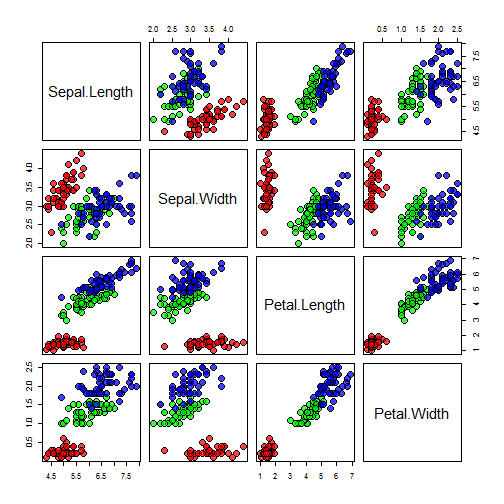

Data Covariate Adjustment
========================================================

Covariate adjustment is a widely used approach in statistical data analysis to improve the power of tests on independent variables. In this context, covariate adjustment plays an integral role the Analysis of Covariance (ANCOVA). However the reader should be warned that the valid application of ANCOVA is note that simple. For a well written discussion of this topic the reader id directed to the well written well written manuscript, [Misunderstanding Analysis od Covariance](http://www.ncbi.nlm.nih.gov/pubmed/11261398).

Covariate adjustment can also be a useful approach in data pre-processing in the context of multivariate modeling. The following is an example application of covariate adjustment using a linear model. The function [covar.adjustment](https://github.com/dgrapov/devium/blob/master/R/Devium%20Statistics.r) part of the [Devium](https://github.com/dgrapov/devium) tool set is used to carry out covariate adjustment on the famous [Iris](http://en.wikipedia.org/wiki/Iris_flower_data_set) data set.

Here are the major steps involved
- [loading Devium](#load) 
- [prepare Iris data](#prepare)
- [visualize raw data](#rawvis)
- [covariate adjust for Species](#covaradj)
- [visualize adjusted data](#adjvis)
- [conclusion](#conclusion)
- [todo](#TODO)


<a name="load"/>
### Load Devium Library

```r
source("http://pastebin.com/raw.php?i=JVyTrYRD")  # source Devium
```


<a name="prepare"/>
### Prepare Iris data

```r
data(iris)
```


<a name="rawvis"/>
### Visualize raw data

```r
plot(data.frame(iris[, !colnames(iris) %in% "Species"]), pch = 21, bg = rainbow(nlevels(iris$Species))[iris$Species])
```

 

Note the difference in the relationship between Sepal.width and Sepal.length for different species of Iris. We may want to adjust all flower measurements to model this relationship independnet of species. However be warned this may be an invalid assumption (see Introduction).

<a name="covaradj"/>
### Create Species adjusted data

```r
factor <- iris$Species
formula <- "factor"
data <- iris[, !colnames(iris) %in% "Species"]
adj.iris <- covar.adjustment(data, formula)
```

The adjustment is done by creating a linear model for each variable and Species labels. The "Species" adjusted data is then the residuals from this model.

<a name="adjvis"/>
### Visualize data adjusted for Species differences

```r
plot(as.data.frame(adj.iris), pch = 21, bg = rainbow(nlevels(iris$Species))[iris$Species])
```

 

Now all the differences in the relationships among variables due to different species is removed (which may make no sense).

<a name="conclusion"/>
### Conclusion of adjustment
In this simple example of covariate adjustment using a linear model all that is really happening is the intercept is now the same for all relationships/species.

<a name="TODO"/>
### Examples to add
1. Covariate adjustment with Principal Components Analysis (PCA)
2. Covariate adjustment with Partial Least Squares (PLS)

&copy; Dmitry Grapov (2014) <a rel="license" href="http://creativecommons.org/licenses/by-nc-sa/4.0/" target="_blank"></a>
